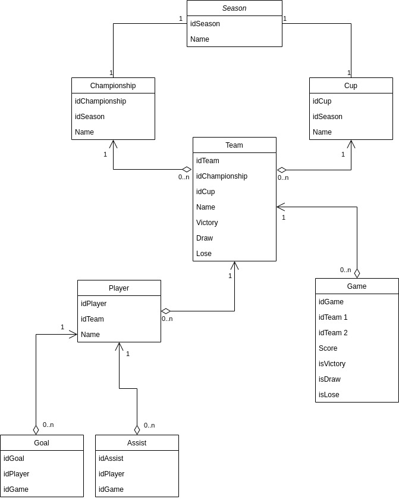
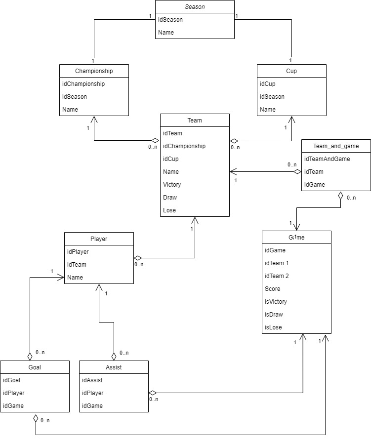

## Requirements:
<!-- 1. User roles:
   - default
   - moderator
   - admin
---
1. Default user:
   - authentification
   - read the information
2. Moderator:
   - edit and add all stats
3. Admin:
   - same as moderator and block user
--- -->
Database diagram:

---
Database description:

**Highlighted** fields are primary keys or part of them

- Season - football season
   - **idSeason** - int
   - Name - varchar(20)

- Championship - football championship
   - **idChampionship** - int
   - idSeason - int(ForeignKey)
   - Name - varchar(20)
 
 - Cup - football cup
   - **idCup** - int
   - idSeason - int(ForeignKey)
   - Name - varchar(20)

- Team - football team
   - **idTeam** - int
   - idChampionship - int(ForeignKey)
   - idCup - int(ForeignKey)
   - Name - varchar(20)
   - Victory - int(count of victories)
   - Draw - int(count of draws)
   - Lose - int(count of loses)

- Player - football player
   - **idPlayer** - int
   - Name - varchar(20)
   - Goal - int(count of goals)
   - Assist - int(count of assists)
   

- Game - football game
   - **idGame** - int
   - Team 1 - int(ForeignKey)
   - Team 2 - int(ForeignKey)
   - Score - varchar(5)
   - isVictory - bool (if first team wins)
   - isDraw - bool (if draw)
   - isLose - bool (if the first team loses)

- Goal
   - **idGoal** - int
   - idPlayer - int(ForeignKey)
   - idGame - int(ForeignKey)

- Assist
   - **idAssist** - int
   - idPlayer - int(ForeignKey)
   - idGame - int(ForeignKey)

---
Normalized database:

